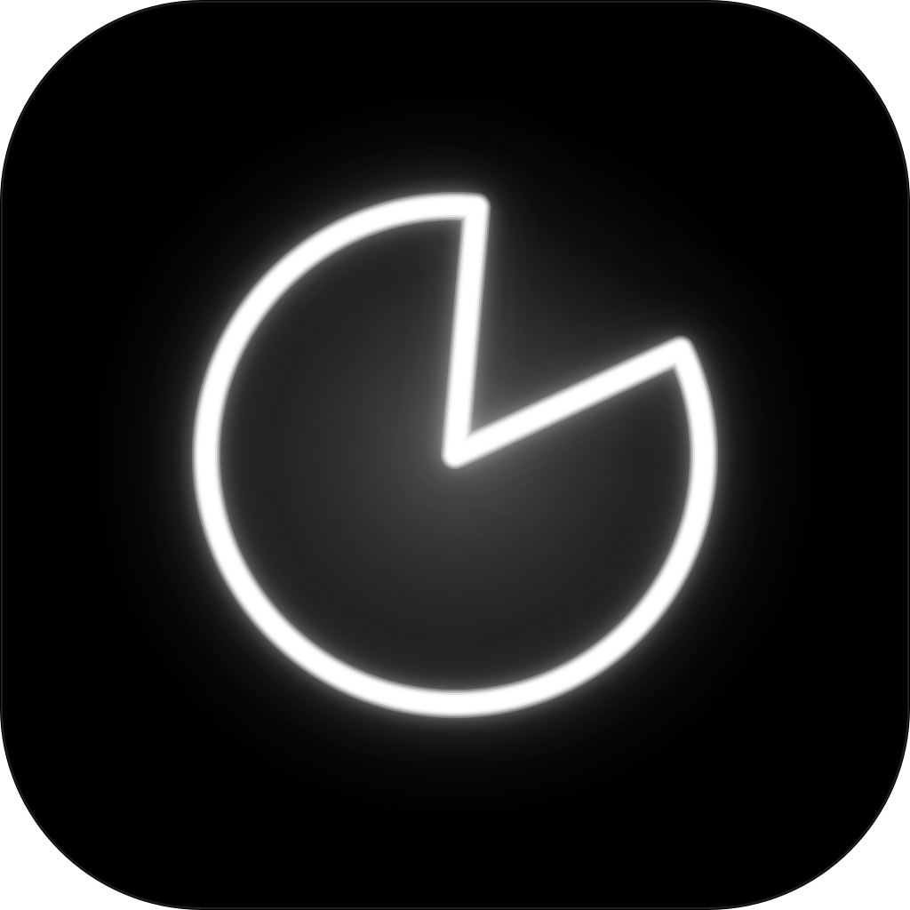
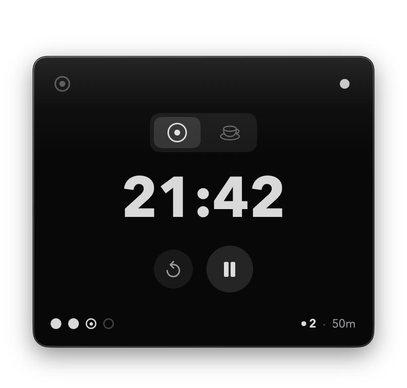
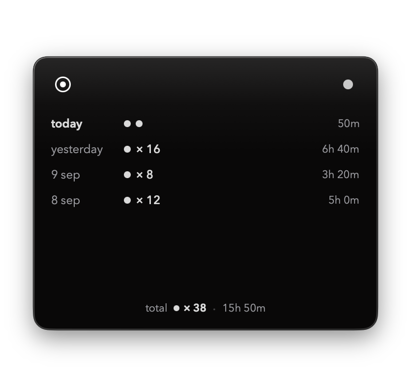
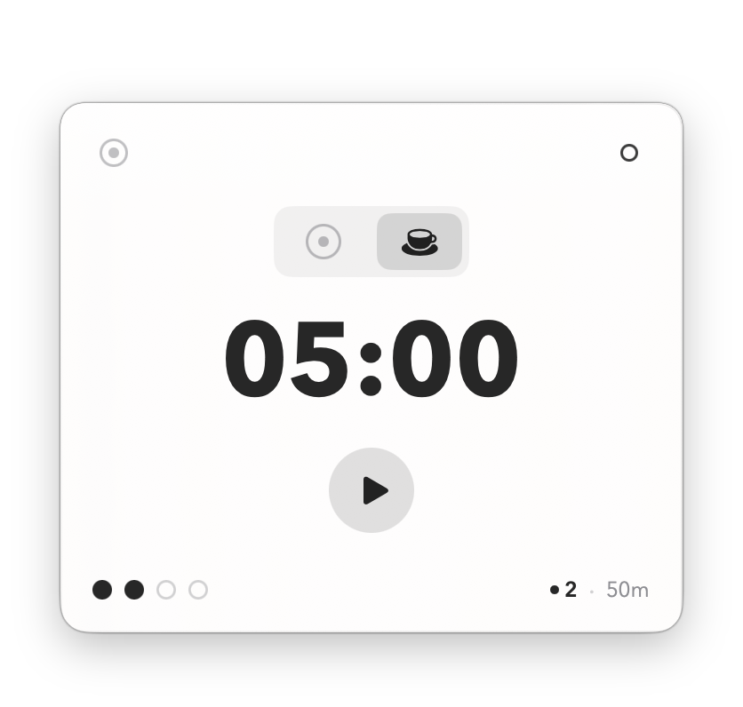

<div align="center">

# POMO

### as minimal as possible focus timer for macos bar

[](https://github.com/lowgame/pomo/releases/latest)
[](https://github.com/lowgame/pomo)
[](LICENSE)
[](https://x.com/hiimthelowgame)

<br/><br/>



<br/><br/>

<p align="center">
  
  
  
</p>

*Strictly 3 colors. Zero icons. Zero clutter. Pure typographic geometry.*

</div>

---

## Design Principles

- **Less, but better** ([Dieter Rams](https://www.vitsoe.com/us/about/good-design)): Zero noisy audio alerts, complicated analytics dashboards, or colorful gamification badges. Pure typographic focus.
- **Data-Ink Ratio** ([Edward Tufte](https://www.edwardtufte.com/books/)): Every pixel is state. Zero decorative borders, dividers, or background boxes.
- **Grid Discipline** ([Massimo Vignelli](https://archive.org/details/thevignellicanon)): Built with `Avenir Next` geometric typography and monospaced digits to guarantee zero menu bar layout shift. Strictly `#000000`, `#8E8E93`, `#FFFFFF`.
- **Zero Friction** ([Hick's Law](https://doi.org/10.1080/17470215208416600)): Global shortcut (`⌘⌥P`) to start/pause from any app, sub-millisecond resident launch.

---

## Features

- **Menu Bar Resident**: Lives silently in your macOS menu bar with fixed-width typography (`25m` idle, `24:59` running).
- **Drift-Free Wall-Clock Engine**: Resilient to macOS sleep and wake. Never loses or gains time.
- **Two Minimalist States**: Focus (25m) and Rest (5m). Semi-automatic transition never traps you in unwanted breaks.
- **Daily Session Dots (`● ● ● ○`)**: 4-session Pomodoro cycle dots with daily total focus duration. Automatically archives and resets at 00:00 midnight.
- **Two-Click Purge (`◎`)**: Click `×` once to prime, twice to permanently purge today's session history. Zero alert dialogs.
- **Single-Pixel Micro Flash**: When a session finishes, a 1-pixel monochrome flash illuminates the top screen edge alongside a silent macOS notification.
- **Monochrome Themes (`⌘D`)**: High-contrast Dark, Light, and System modes crafted for LiquidGlass material physics.
- **Shortcuts**: `⌘⌥P` (start/pause), `⌘R` (reset), `1` (focus mode), `2` (rest mode), `⌘D` (toggle theme), `esc` (dismiss).
- **iCloud Sync**: Local JSON storage in `~/Library/Application Support/pomo/` mirrored seamlessly to iCloud Drive.
- **Featherweight**: Native Swift 6, SwiftUI & AppKit. Under 1 MB binary.

---

## Shortcuts

| Shortcut | Action | Scope |
| :--- | :--- | :--- |
| `⌘⌥P` | Start / Pause timer | Global & Local |
| `⌘R` | Reset current timer | Local |
| `1` | Switch to Focus (25m) | Local |
| `2` | Switch to Rest (5m) | Local |
| `⌘D` | Toggle Dark / Light / System theme | Local |
| `esc` | Dismiss popover panel | Local |

---

## Installation

Download **[pomo.dmg](https://github.com/lowgame/pomo/releases/latest)**, drag **pomo.app** to `/Applications`, and open.

```bash
# Or install via Homebrew
brew install lowgame/tap/pomo

# Or build from source
git clone https://github.com/lowgame/pomo.git && cd pomo && ./Scripts/create_dmg.sh
```

---

## Author & License

Created by **Ahmet Kamer** — [@hiimthelowgame](https://x.com/hiimthelowgame) on X · [@lowgame](https://github.com/lowgame) on GitHub.  
Released under the [MIT License](LICENSE).
